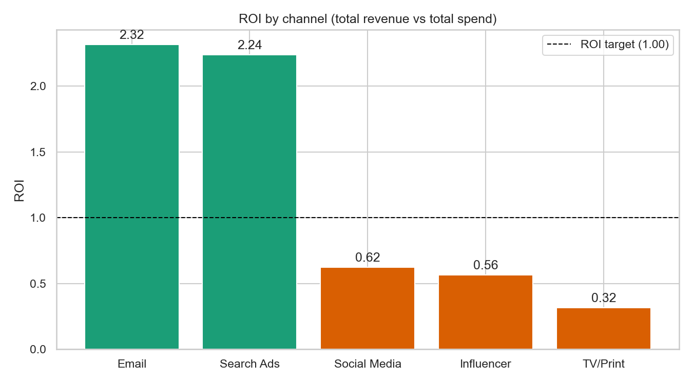
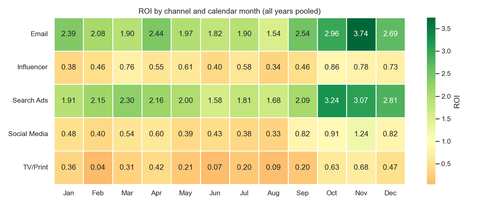
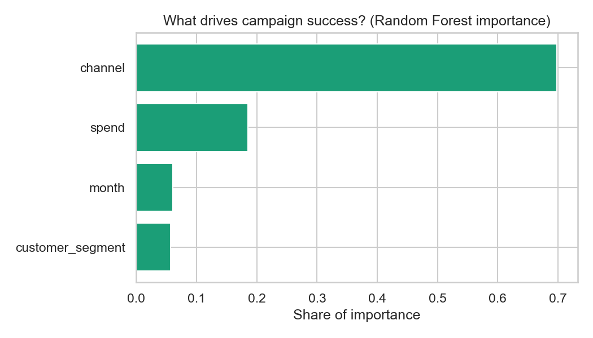

# CampaignIQ: AI-Powered Marketing Campaign ROI Analysis & Optimization

CampaignIQ answers four questions a marketing team struggles with: which campaigns actually drove
revenue, which channel gives the best ROI, which customer segments respond to which channel, and
which planned campaigns are likely to underperform *before* the money is spent.

It is an end-to-end pipeline: clean raw data -> calculate KPIs -> explore -> train a success
predictor -> interactive dashboard -> auto-generated executive summary.

## Features
- **Cleaning:** duplicates, mixed date formats, inconsistent labels, currency text, missing/negative values, with an audit trail of rows removed
- **KPIs:** ROI, ROAS, CTR, conversion rate, CPA, duration, month/quarter/season
- **EDA:** 5 charts (trend, ROI by channel, spend vs revenue bubbles, channel x month heatmap, segment x channel heatmap)
- **ML:** Logistic Regression vs Random Forest predicting whether a campaign hits its ROI target (leakage-free features, cross-validated model choice)
- **Predictor:** `predict_campaign(channel, budget, month, segment)` returns a probability and Fund / Risky / Avoid
- **Dashboard:** Streamlit + Plotly with date/channel/segment filters, KPI cards and a what-if predictor
- **Report:** rule-based recommendations with noise guards, written to Markdown (optional LLM narrative)

## Tech stack
Python 3.10+, pandas, NumPy, SciPy, scikit-learn, Matplotlib, Seaborn, Plotly, Streamlit, joblib

## Setup
```bash
# macOS / Linux
python3 -m venv venv && source venv/bin/activate
# Windows PowerShell
python -m venv venv; venv\Scripts\Activate.ps1

pip install -r requirements.txt
```

## Run everything
One command (about 20-40 seconds):
```bash
python run_all.py
streamlit run dashboard/app.py
```
Or step by step:

| # | Command | Produces |
|---|---|---|
| 1 | `python src/generate_data.py` | `data/raw/campaigns_raw.csv` (messy, 2,000 rows) |
| 2 | `python src/01_clean_data.py` | `data/processed/clean_campaigns.csv` |
| 3 | `python src/02_features.py` | `data/processed/features.csv` |
| 4 | `python src/03_eda.py` | 5 charts in `reports/figures/` |
| 5 | `python src/04_model.py` | `models/campaign_model.pkl`, metrics, 3 charts |
| 6 | `python src/05_predict.py` | console demo of the predictor |
| 7 | `python src/06_report.py` | `reports/executive_summary.md` |
| 8 | `streamlit run dashboard/app.py` | the dashboard at http://localhost:8501 |

## About the data
All input data is **synthetic**, generated by `src/generate_data.py` with a fixed seed (42) so the
results are reproducible. The generator plants realistic structure - channel quality differences,
festive seasonality (Oct-Dec), segment-channel affinity, and diminishing returns on large budgets -
and then deliberately injects the kinds of messiness real marketing exports contain: mixed date
formats, inconsistent channel spellings, currency symbols embedded in numeric columns, missing
values, negative amounts from sign errors, funnel violations (clicks > impressions), and duplicate
rows. Cleaning then removes ~9% of raw rows, and the script prints an audit trail of exactly what
was lost and why.

The point of this project is the **method**: a defensible pipeline from raw mess to business
recommendations. On real data, the pipeline is unchanged; only the generator gets swapped out.

## Results




Add a dashboard screenshot as `docs/dashboard.png` and reference it here:
``

## Project structure
```
CampaignIQ/
├── data/raw/            raw input (git-ignored)
├── data/processed/      cleaned + engineered data (git-ignored)
├── src/                 numbered pipeline scripts + data generator
├── dashboard/app.py     Streamlit app
├── models/              saved model + metrics
├── reports/             executive_summary.md + figures/
├── notebooks/           scratch space
├── run_all.py           runs the pipeline in order
└── requirements.txt     pinned dependencies
```

## Limitations
- Results are associations in past data, not proof of causation.
- All data is synthetic, with patterns deliberately planted by `src/generate_data.py`: this project demonstrates the method, not any real market.
- The predictor sees only channel, budget, month and segment. It cannot see creative quality, competitors or pricing.
- Predictions outside the historical budget range are unreliable.

## Optional: LLM narrative
`src/06_report.py` ends with a commented block that sends the aggregated summary (never raw rows) to
an LLM API to write an executive narrative. Set your key as the `ANTHROPIC_API_KEY` environment variable.